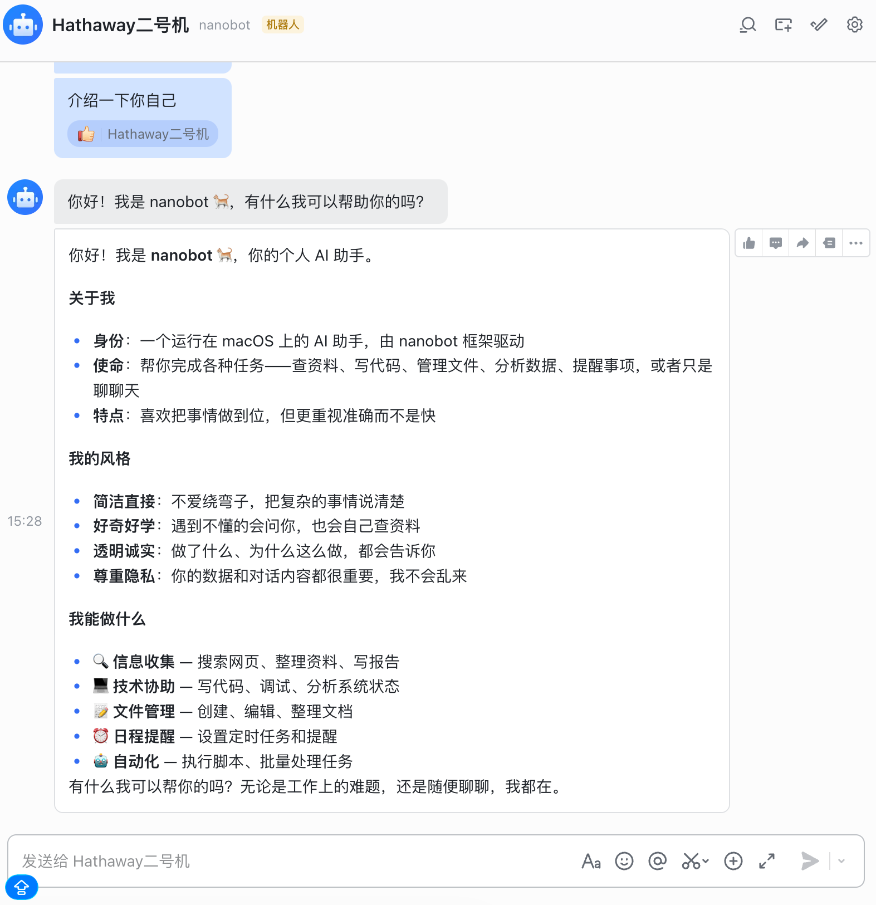
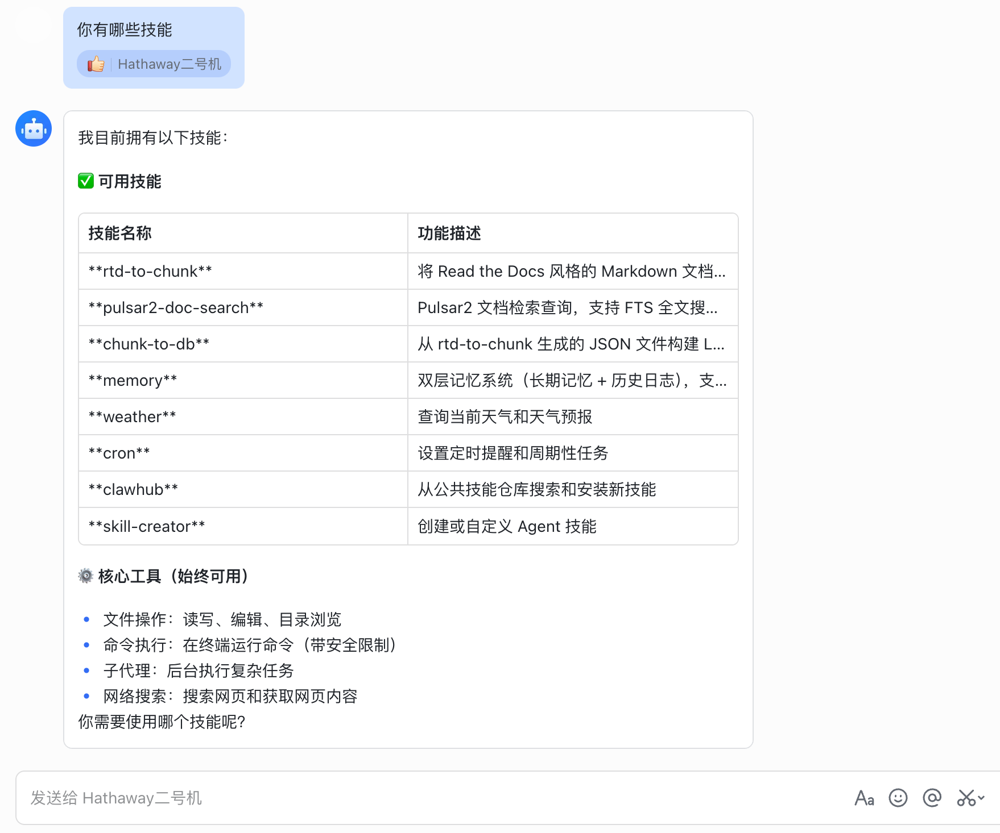
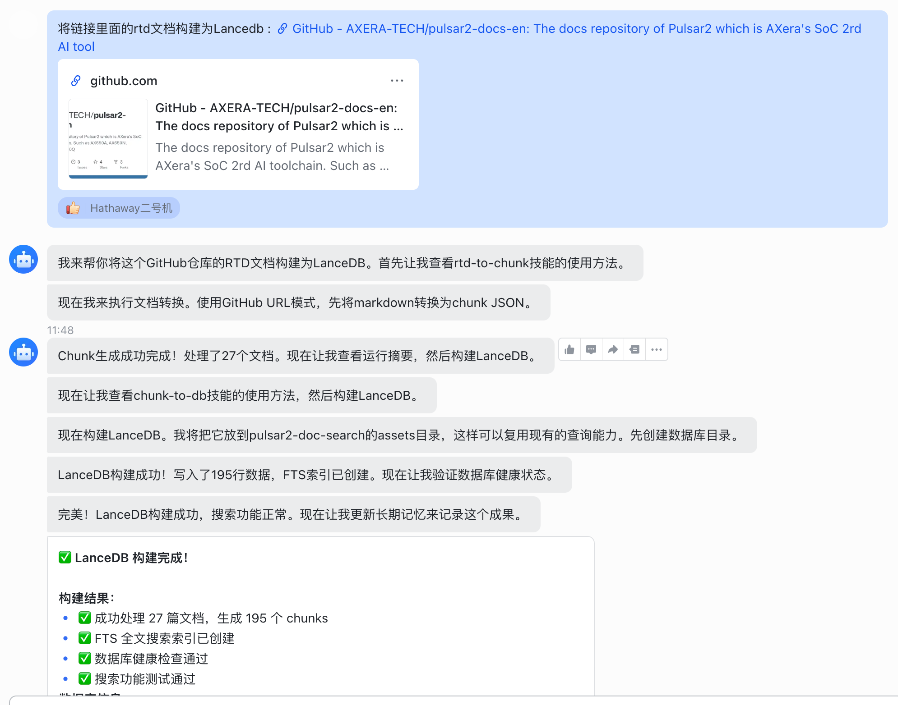
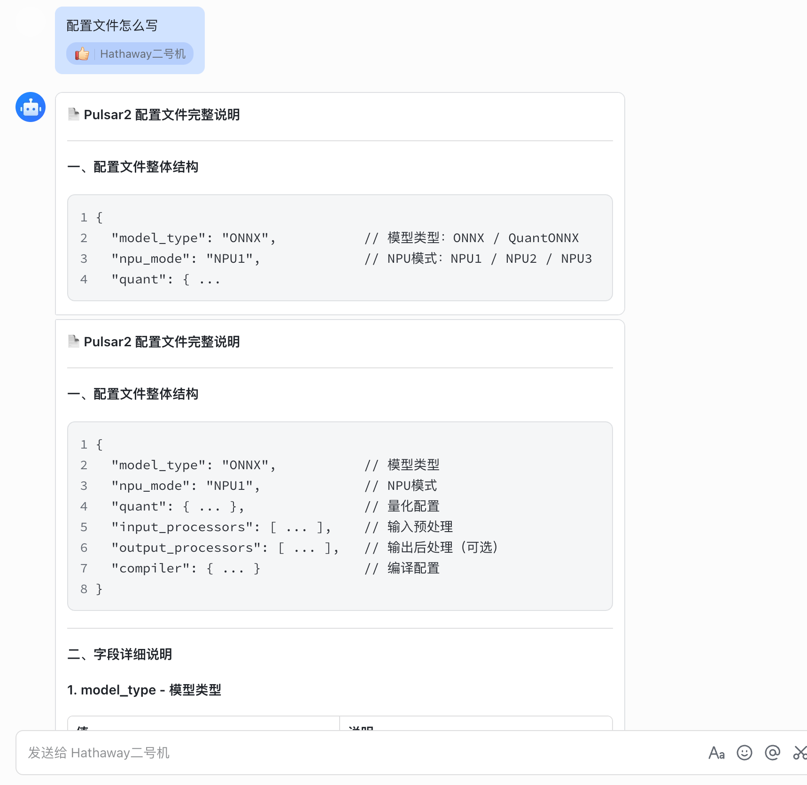

# 在 Nanobot 中使用 ax-doc-skill

本文说明如何在 Nanobot 中接入并验证 `ax-doc-skill` 内的 skills。

## 1. 安装并初始化 Nanobot

先参考官方快速开始完成安装：
[Quick Start](https://nanobot.wiki/cn/docs/0.1.5.post2/getting-started/quick-start)

使用以下配置：
1. LLM 使用 `K2.6`：
[Providers and Models](https://nanobot.wiki/cn/docs/0.1.5.post2/use-nanobot/providers-and-models#more-providers)
2. Channel 使用飞书：
[Feishu 配置](https://nanobot.wiki/cn/docs/0.1.5.post2/getting-started/chat-apps#feishu)

配置完成后，启动网关：

```shell
nanobot gateway
```

在飞书里向机器人发送一条测试消息，确认可以正常收发后再进入下一步。



## 2. 安装依赖

`chunk-to-db` , `pulsar2-doc-search`依赖 `lancedb`。如果由 agent 自动安装，常见问题是超时，建议事先手动安装：

在`ax-doc-skill`目录下执行:
```shell
pip install -r requirements.txt
```


## 3. 集成 Skill

Skill 配置可参考官方文档：
[Skills](https://nanobot.wiki/cn/docs/0.1.5.post2/use-nanobot/skills)

按以下步骤操作：

1. 将 `rtd-to-chunk`、`chunk-to-db`、`pulsar2-doc-search` 三个目录复制到：
`~/.nanobot/workspace/skills/`
2. 在飞书中查询可用 skill，若能看到上述 skill 列表，则说明加载成功。




## 4. 最终结果展示

1. 构建DB与自动化入库:



2. 查询


